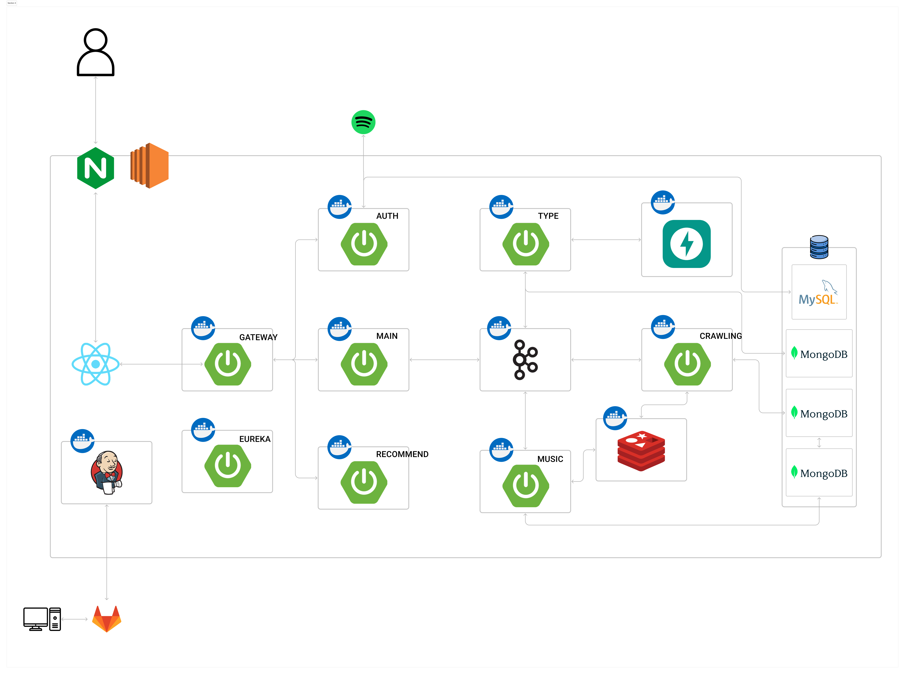
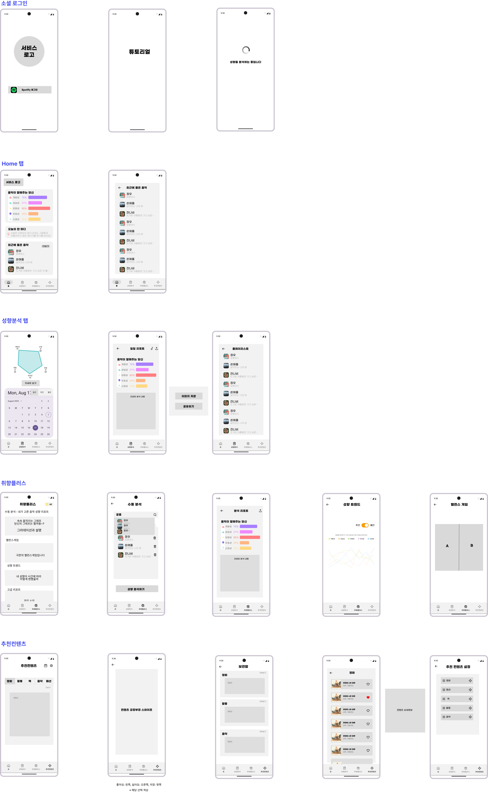
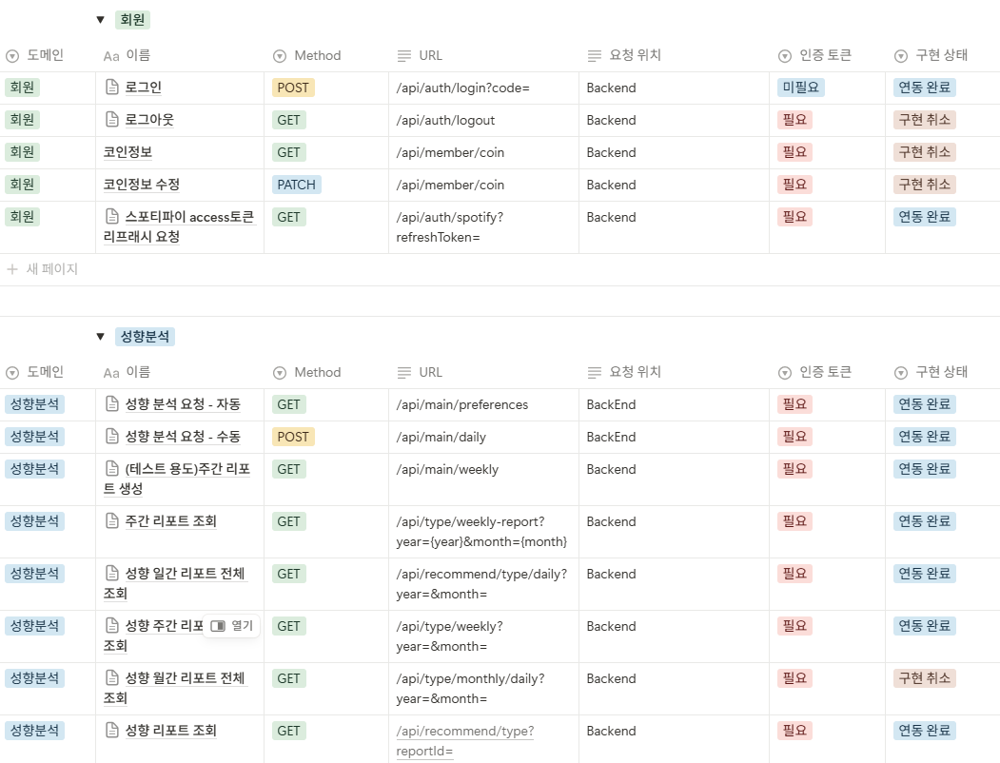
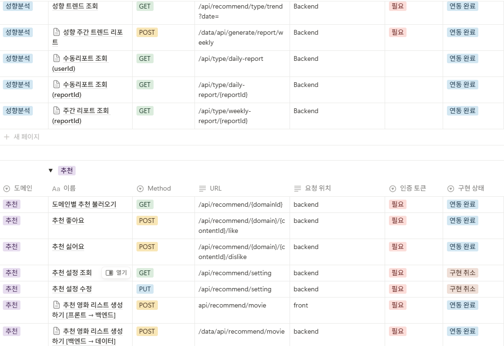
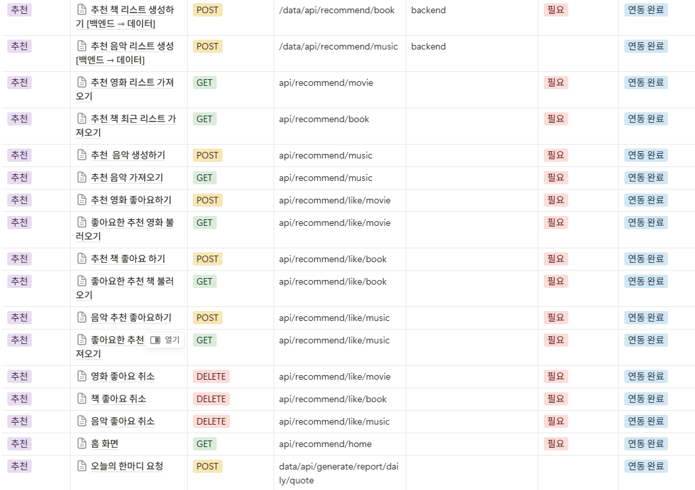
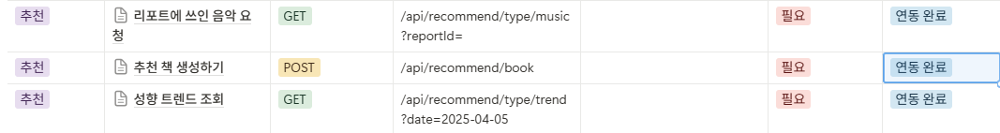
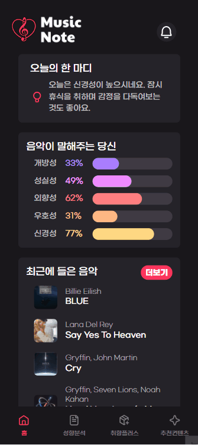
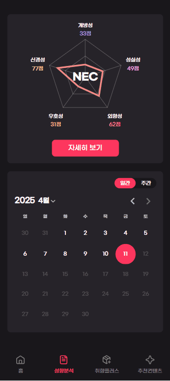
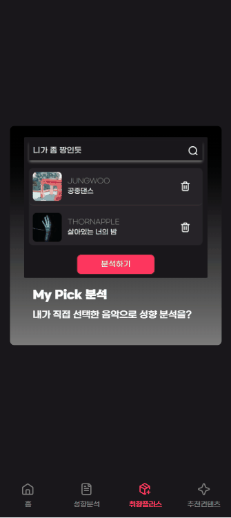

# MusicNote

## 📌 프로젝트 소개

### 당신이 듣는 음악이 당신을 말하다. 유저들이 들은 음악을 바탕으로 사람들의 성향을 분석하고, 성향에 어울리는 크로스 도메인을 추천하는 프로젝트입니다.

 

1. **Spotify API를 활용하여 최근 들은 음악을 기준으로 성향을 분석합니다.**
2. **분석한 성향 (Big Five 기반)을 일간, 주간 기준으로 레포트를 제공합니다.**
3. **분석한 성향을 바탕으로 유저가 좋아할만한 영화와 음악을 추천합니다.**

 

### 1️⃣ 프로젝트 기간

2025.02.24 ~ 2025.04.11

### 2️⃣ 팀원 소개

| 이름   | 역할  | 구현 기능                                                                                                          |
| ------ | ----- | ------------------------------------------------------------------------------------------------------------------ |
| 민경현 | FE    | Wireframe 작성, Flowchart 작성, UI 디자인, 로그인, 홈, 추천컨텐츠 탭 구현                                          |
| 주현호 | FE    | Wireframe 작성, Flowchart 작성, UI 디자인, 성향분석, 취향플러스 탭 구현                                            |
| 손승범 | BE    | API 명세서 작성, BE 개발, DB 관리                                                                                  |
|        | Infra | 배포 환경 구축                                                                                                     |
| 문인규 | BE    | API 명세서 작성, BE 개발, DB 관리                                                                                  |
| 남기운 | Data  | 영화 추천 모델 학습, 키워드 기반 음악 추천 알고리즘                                                                |
| 윤상흠 | Data  | 분석 서버 API 명세서 작성, 성격 예측 모델 학습, 성격별 키워드 추출 모델, 키워드 기반 책 추천 알고리즘, 분석 리포트 |
|        | Infra | 분석 서버 배포 환경 구축                                                                                           |

### 3️⃣ 기술 스택

| 분야  | 기술 스택                                |
| ----- | ---------------------------------------- |
| FE    | React 19, TypeScript, HTML, Tailwind CSS |
| BE    | Java 17, Spring Boot, Kafka              |
| Data  | Fast API, Pytorch, scikit-learn          |
| DB    | MySQL, Redis, MongoDB                    |
| Infra | AWS EC2, Jenkins, NginX, Docker          |

 

## 📌 아키텍처 다이어그램

 

## 📌 플로우 차트

 

## 📌 와이어프레임

 

## 📌 API 명세서

## 📌 주요 기능

### 1.로그인

### 2.홈

### 3.일일레포트

### 4.주간레포트

### 5.수동분석

### 6.성향트렌드

### 7.추천컨텐츠

### 📌 배포

- 서비스 URL: http://j12a308.p.ssafy.io/
- 배포 기간: 2025.03.24 ~ 2025.04.18
- [포팅 매뉴얼](./exec/1.%20빌드%20및%20배포에%20필요한%20정보.md)
